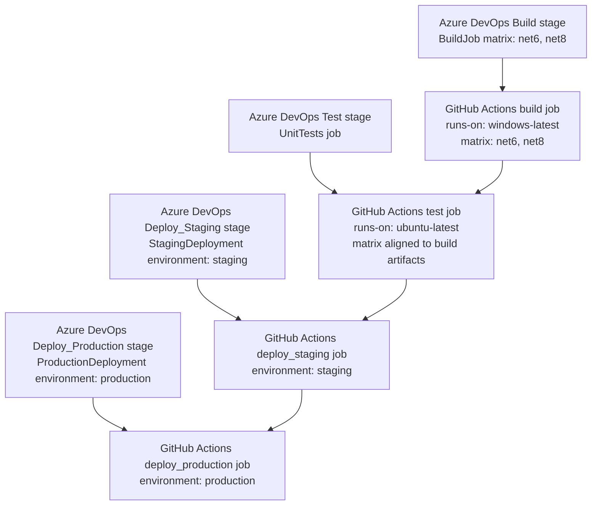

# 🚀 Azure DevOps to GitHub Actions Migration Report

## Overview

| Item | Azure DevOps source | GitHub Actions result |
| --- | --- | --- |
| Triggers | `main`, `release/*`, PRs to `main` | `on.push.branches` and `on.pull_request.branches` preserved |
| Stages | 4 (`Build`, `Test`, `Deploy_Staging`, `Deploy_Production`) | 4 jobs (`build`, `test`, `deploy_staging`, `deploy_production`) |
| Jobs | 4 logical jobs | 4 jobs, with matrix expansion where needed |
| Matrix | 2 entries (`net6`, `net8`) | 2 matrix entries on build and test jobs |
| Azure tasks/keywords converted | `UseDotNet@2`, `PublishTestResults@2`, `publish`, `download`, deployment jobs | `actions/setup-dotnet`, `dorny/test-reporter`, `upload-artifact`, `download-artifact`, job `environment` |
| Variable sources | `Common-Variables` group, `buildConfiguration=Release` | Workflow `env` for `buildConfiguration`; variable-group values require GitHub vars/secrets migration |
| Environments | `staging`, `production` | GitHub Environments `staging`, `production` |

## Mermaid conversion diagram

## Key transformations

### Stage to job mapping

| Azure DevOps stage/job | GitHub Actions job | Notes |
| --- | --- | --- |
| `Build` / `BuildJob` | `build` | Preserved Windows runner and .NET SDK matrix (`6.0.x`, `8.0.x`) |
| `Test` / `UnitTests` | `test` | Preserved Ubuntu runner; matrix duplicated to keep artifact names unique and validate both SDK lanes |
| `Deploy_Staging` / `StagingDeployment` | `deploy_staging` | Converted deployment job to standard job with `environment: staging` |
| `Deploy_Production` / `ProductionDeployment` | `deploy_production` | Converted deployment job to standard job with `environment: production` |

### Task mapping

| Azure DevOps construct | GitHub Actions equivalent |
| --- | --- |
| `UseDotNet@2` | `actions/setup-dotnet@4d6c8fcf3c8f7a60068d26b594648e99df24cee3` |
| `script:` | `run:` |
| `publish: $(Build.ArtifactStagingDirectory)` / `artifact: drop` | `actions/upload-artifact@65462800fd760344b1a7b4382951275a0abb4808` |
| `download: current` / `artifact: drop` | `actions/download-artifact@65a9edc5881444af0b9093a5e628f2fe47ea3b2e` |
| `PublishTestResults@2` | `dorny/test-reporter@31a54ee7ebcacc03a09ea97a7e5465a47b84aea5` |
| `deployment` + `environment` | Standard job + `environment:` key |

### Variable mapping

| Azure DevOps variable source | GitHub Actions mapping |
| --- | --- |
| `buildConfiguration=Release` | Workflow-level `env.buildConfiguration: Release` |
| Variable group `Common-Variables` | Manual migration to repository/org/environment `vars` and `secrets` (`${{ vars.NAME }}` / `${{ secrets.NAME }}`) |

## Actionlint results

- Command attempted: `actionlint C:\Users\v-selvanse\Downloads\Test1\.github\workflows\azure-devops-gha.yml`
- Result: `actionlint` is not installed in the local environment, so no static workflow lint output was produced.

## Manual verification checklist

- [ ] Confirm the repository's active integration branch is `main` and update the default branch from `master` if desired.
- [ ] Verify `dotnet restore`, `dotnet build`, and `dotnet test` succeed on GitHub-hosted runners for both `6.0.x` and `8.0.x`.
- [ ] Confirm the uploaded `drop-net6` and `drop-net8` artifacts contain the files expected by downstream jobs.
- [ ] Review whether test execution truly needs both SDK lanes; keep or simplify the duplicated test matrix based on repository targets.
- [ ] Create GitHub Environments `staging` and `production` before enabling deployment approvals.
- [ ] Add any required values from Azure DevOps variable group `Common-Variables` as GitHub variables or secrets.
- [ ] Run the workflow from a branch targeting `main` and verify test reports appear in the Checks UI.

## Security improvements

- All third-party actions are pinned to immutable SHAs.
- Test reporting uses `secrets.GITHUB_TOKEN` instead of a hard-coded credential.
- Deployment gates are represented with GitHub Environments so approvals and protected secrets can be enforced per environment.
- The original Azure DevOps pipeline file was archived under `.github/ci-archive/` to reduce accidental dual-CI execution.

## Required secrets/variables from `Common-Variables`

The provided pipeline references the Azure DevOps variable group `Common-Variables` but does not expose any individual variable names or secret keys from that group. Based on the YAML alone:

| Source | Detected keys in YAML | Migration action |
| --- | --- | --- |
| `Common-Variables` | None explicitly referenced | Review the variable group in Azure DevOps and recreate each required non-secret as a GitHub Variable and each secret as a GitHub Secret |
| Inline variable `buildConfiguration` | `buildConfiguration=Release` | Already migrated into workflow `env` |

## Required GitHub Environments

| Environment | Purpose | Recommended protection rules |
| --- | --- | --- |
| `staging` | Maps Azure DevOps `staging` deployment environment | Optional required reviewers, environment-scoped variables/secrets, deployment history enabled |
| `production` | Maps Azure DevOps `production` deployment environment | Required reviewers/approvals, restricted branch deployment rules, environment-scoped secrets |

## Next steps

1. Review `.github/workflows/azure-devops-gha.yml` and confirm the artifact contents match your deployment expectations.
2. Populate GitHub variables/secrets that replace `Common-Variables`.
3. Configure `staging` and `production` environments with the desired approval rules.
4. Merge this PR into `main`, then disable/remove Azure DevOps pipeline execution if it is still active elsewhere.
5. Optionally switch the repository default branch from `master` to `main` to match the migrated workflow triggers.

## Caveats

- `PublishTestResults@2` was migrated to `dorny/test-reporter`; this requires workflow `checks: write` permission and publishes results to the GitHub Checks UI.
- Azure DevOps deployment jobs were converted to standard GitHub Actions jobs using `environment:` because GitHub environments provide the closest approval/protection model.
- The source pipeline published `$(Build.ArtifactStagingDirectory)` without an explicit staging step; the migrated workflow uploads the repository workspace so downstream jobs always have a downloadable artifact.
- The repository originally used `master` as the remote default branch. A `main` branch was created to support the requested PR base and workflow trigger configuration.
